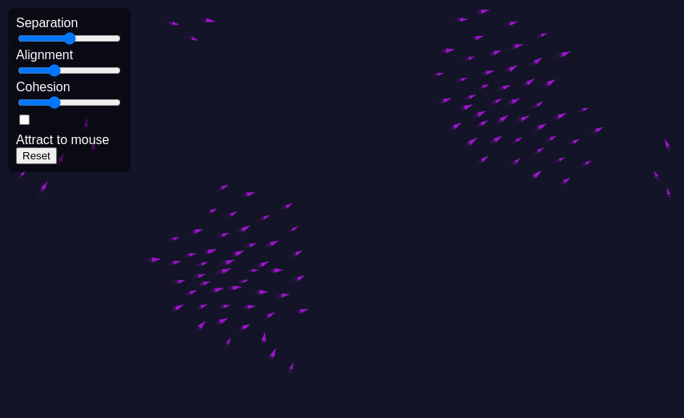

# 🌀 Flocking Simulation

A simple and interactive flocking simulation built using [p5.js].

🌐 [Live Demo](https://0x1e9307.github.io/Boids-algorithm-demonstration/)

## 🎮 Features

- Adjustable parameters: separation, alignment, cohesion
- "Attract to mouse" toggle
- Add boids by clicking the canvas
- Responsive to window resizing

## 📦 Usage

1. Clone or download the repository
2. Open `index.html` in a browser

## 🛠 Built With

- [p5.js](https://p5js.org/)
- Vanilla HTML/CSS/JS

## 📸 Screenshot

---

Inspired by Craig Reynolds' Boids algorithm.

